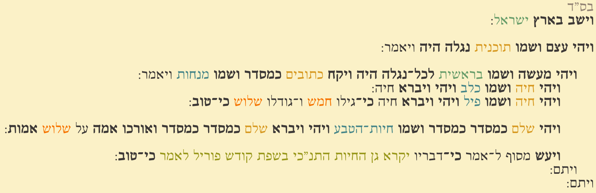

# The Motzie B'She'ela

Official compiler for the Codesh programming language.

<p align="center">
  
  &nbsp;&nbsp;&nbsp;
  
</p>

## About
**Codesh** *(קודש)* is an esoteric programming language created by Stav Solomon and Eliran Ben Moshe whose syntax is modeled after the Hebrew Bible *(Tanakh)*.

**The Motzi B'She'ela** *(המוציא בשאלה)* is the official compiler for Codesh. It translates **Codesh source code** into **JVM bytecode**.

## Codesh

For **full language documentation**, see [the project wiki](https://github.com/Codesh-Organization-Foundation-Inc/Codesh-Compiler/wiki).

You can learn more about the language on the [Codesh (קודש) Esolang page](https://esolangs.org/wiki/Codesh_(%D7%A7%D7%95%D7%93%D7%A9)).

See code examples [here](https://github.com/Codesh-Organization-Foundation-Inc/Codesh-Compiler/tree/main/Examples).

## IDEs
[**Kate**](https://kate-editor.org/) and [**KDevelop**](https://kdevelop.org/) offer the best support for RTL coding. Both are extremely recommended for writing in Codesh, with Kate being more lightweight.

Codesh provides support for both editors - including syntax highlighting, indentation, and more. See [this repo](https://github.com/Codesh-Organization-Foundation-Inc/Codesh-for-Kate) for more details.

The Motzie B'She'ela additionally provides an **LSP mode** that can be enabled using the `--lsp` flag:
```bash
codeshc --lsp
```

...allowing integration with **any IDE** that supports the Language Server Protocol *(including the aforementioned editors)*.

## Installation

1. Grab the [latest portable release](https://github.com/Codesh-Organization-Foundation-Inc/Codesh-Compiler/releases/latest) for your platform
2. Unzip it
3. Enjoy

### Optional: Global Installation

You can install `codeshc` and Talmud Codesh *(native library of Codesh)* globally by running:

```bash
./install-global.sh ./ # Unix
./install-global.ps1 ./ # Windows
```

The script is already present within the portable installation as both a Bash or PowerShell script.

The global installation provides system-wide access to `codeshc`.
  * **On Unix:** Links `codeshc` to `/usr/local/bin/`.
  * **On Windows**: Installs into `C:\Program Files\קודש` which is then added to the system's `PATH`.

## Talmud Codesh
In Codesh terminology, a Talmud is **a library written in the Codesh programming language.**

**Talmud Codesh** refersh to the standard library (talmud) of Codesh. Most notibly, it provides the `מסוף` class, allowing for the following syntax:

```codesh
ויעש מסוף ל־אמר כי־דבריו יקרא היי אמא לאמר כי־טוב:
```

Talmud Codesh comes pre-installed in the portable builds of The Motzie B'She'ela under the name `תלמוד־קודש.jar`.

## The Java Runtime Environment
**Codesh requires\* the JRE to be present.**  
**Recommended version:** 21.

<sub>
*If you really dislike the JRE, you can use `--tzadik` and `--unholy` as well as to not compile to `.jar` files. This removes dependencies on both Talmud Codesh and the JRE.
<br/>
Talmud Codesh needs the JRE to properly work.
</sub>

## Compiling
There are two primary ways to compile Codesh source code:

### Compile to JAR (Recommended)
```bash
codeshc --src <source-file/directory> --dest <output-file>.jar
```

>[!IMPORTANT]
> Note the presence of the `.jar` suffix.

#### Options

* **`--imashkha-kol-kakh-shmena`**: Bundles all required libraries into the output JAR. **This includes Talmud Codesh**.  
This makes the resulting file fully portable, allowing it to run on systems even without Codesh installed.
* **`--main-class <class-name>`**: Specifies the main class in Fully Qualified Name *(packages separated by dots)*. Only necessary when **more than one** `מעשה בראשית ויקח כתובים כמסדר` method is present within the project files.

### Compile to Class Files

```bash
codeshc --src <source-file/directory> --dest <output-directory>
```

>[!IMPORTANT]
> Note the *absence* of the `.jar` suffix.

## Default Paths
The default paths below can be overwritten using `--talmud-codesh-path` and `"--jre-path`.

### JRE
The Motzie B'She'ela will first use `JAVA_HOME` if present. Otherwise, it is platform-dependent:
* **Unix:** `/usr/lib/jvm/jre-21`
* **Windows:** `C:\Program Files\Java\jre-21`

### Talmud Codesh
Always `./תלמוד־קודש.jar`, **relative to the binary's directory**.
